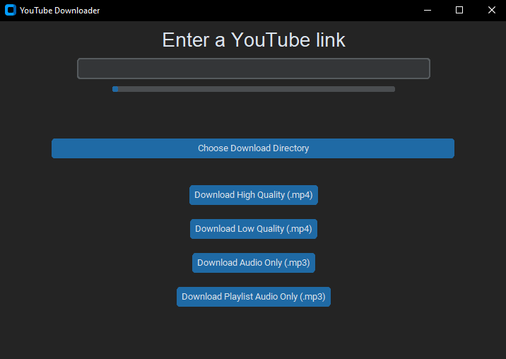

# YouTube Downloader


I created this simple app so I can download my favorite YouTube videos and playlists directly to your computer with just a few clicks! 🎶📹

## Features

- **Download Videos in Different Qualities**: Choose from high or low resolution for videos.
- **Audio-Only Downloads**: Grab the audio in MP3 format from your favorite videos and playlists.
- **Playlist Support**: Download entire playlists as audio in one go!
- **Progress Bar**: Track your download progress in real-time, so you always know how much longer until your video or playlist is ready.
- **Customizable Download Location**: Choose where you want to store your downloads with a simple directory picker.

## Requirements

- **Python 3.x**
- **pytube**.
- **customtkinter**.
- **tkinter**.

## Installation

1. Clone or download this repository to your local machine.
2. Install the required dependencies by running:
```
pip install -r requirements.txt
```
3. Run the `downloader.py` file and let the app handle the rest! 🎉

## Usage

1. **Enter a YouTube link**: Paste the link of a video or playlist in the provided field.
2. **Choose your download quality**:
- **High Quality (.mp4)** for the best video resolution.
- **Low Quality (.mp4)** for smaller file sizes.
- **Audio Only (.mp3)** for just the sound.
3. **Download Playlist**: Download the entire playlist as audio files.
4. **Track Progress**: Watch the download progress on the sleek progress bar

